<div align="center">

# Naomi

**You talk. Naomi remembers.**

A local-first memory assistant for Android. Speak a thought; it becomes a titled,
filed, connected memory — without leaving your phone.

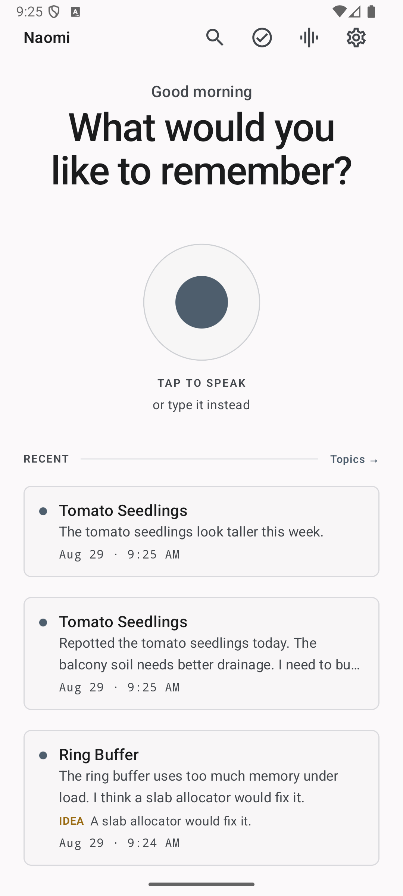

</div>

---

## What it does

Most note apps give you a list. Naomi gives you a subject that grows.

Say this:

> "The greenhouse tomatoes are flowering early."

Naomi titles it **Greenhouse Tomatoes** and files it. Then, days later, you say:

> "I fixed the greenhouse tomatoes with crushed eggshell."

It does **not** make a second note. It recognises the thing you are already
talking about, adds this to that memory's history, and updates what the memory
currently says. Say a third thing and it does the same. One subject, dated, in the
order you said it:

<div align="center">
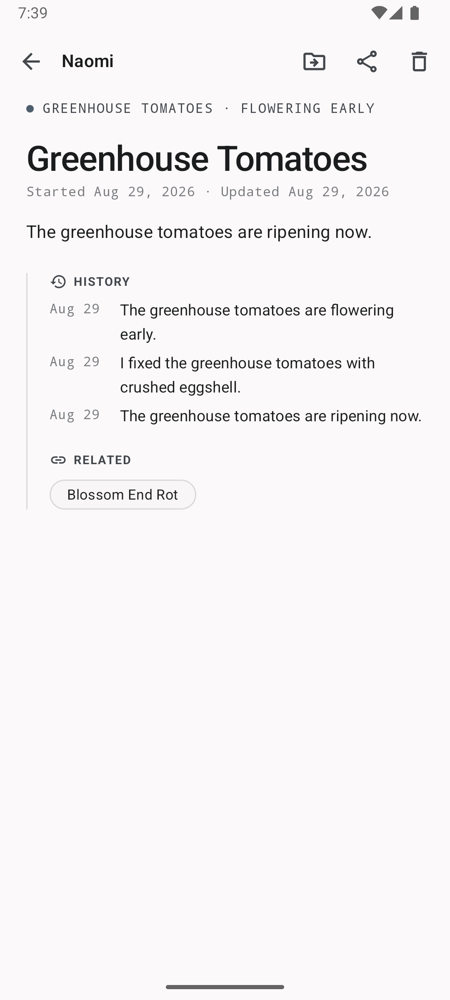
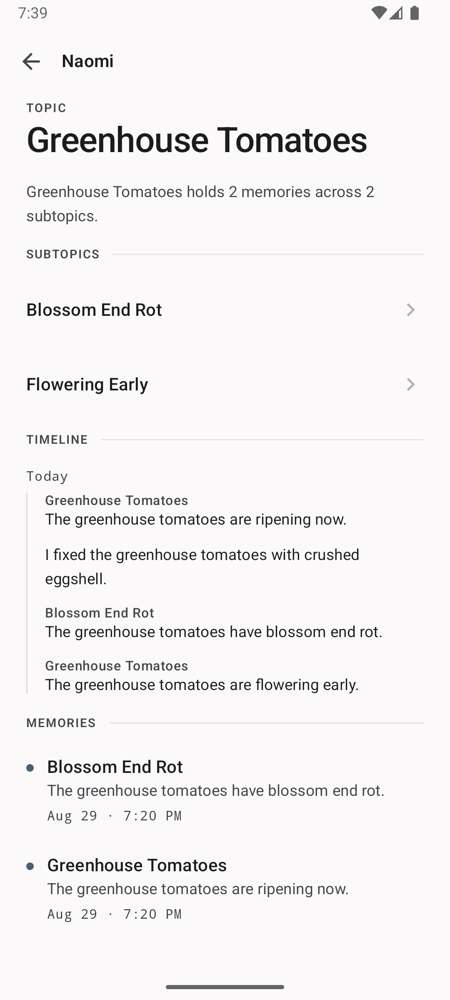
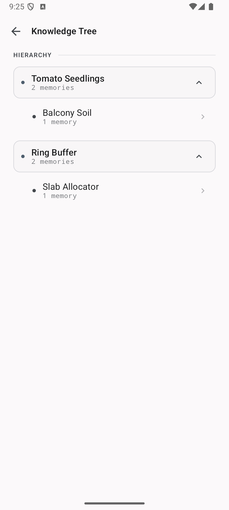
</div>

Later, ask for it back in the words you would actually use:

> "What did I say about the greenhouse tomatoes?"

<div align="center">
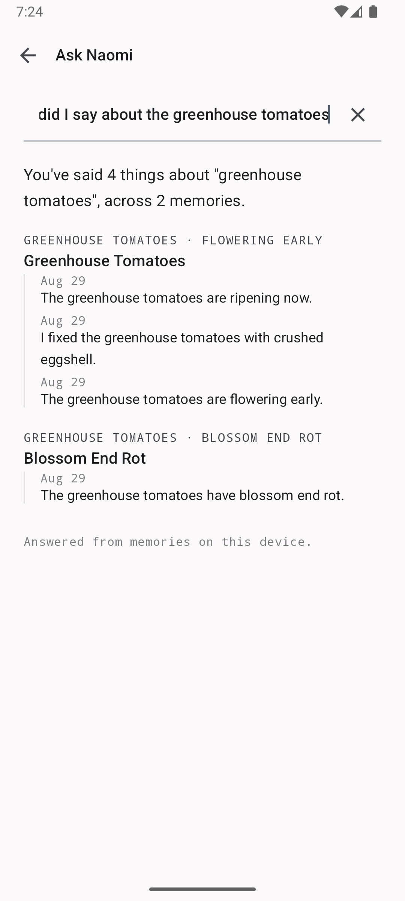
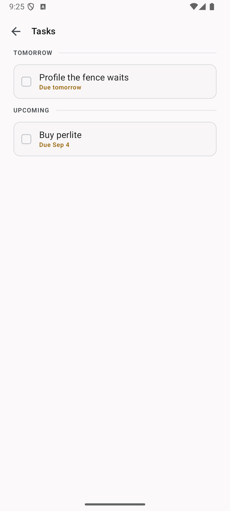
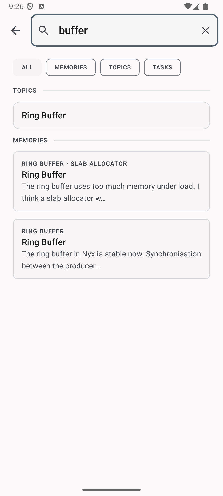
</div>

Nothing in that answer is generated. Every line is either a fixed phrase or text
you recorded yourself — see [Ask Naomi](#ask-naomi) below.

That accumulation is the whole product. A note app that files every sentence as a
new item has not remembered anything; it has taken dictation.

### Ask Naomi

Recall runs entirely against the local store, and it never writes prose on your
behalf. The one sentence Naomi says in its own voice reports counts — *"You've
said 4 things about "greenhouse tomatoes", across 2 memories"* — so it has no way
to be wrong about content. There is deliberately no generated-answer case in the
`Answer` type.

An assistant that invents a plausible memory is worse than one that says it has
nothing, because you cannot tell the two apart. What Naomi hands back being what
you actually said is the entire promise.

---

## Privacy

Naomi's privacy claim is not a policy — it is a property of the build, and you can
check it yourself in under a minute:

```bash
./gradlew assembleOfflineRelease
aapt2 dump permissions app/build/outputs/apk/offline/release/app-offline-release.apk
```

That prints the complete permission list of the shipped APK:

| Permission | Why |
|---|---|
| `RECORD_AUDIO` | Speech capture |
| `FOREGROUND_SERVICE` + `FOREGROUND_SERVICE_MICROPHONE` | Ambient mode keeps recording when the app is backgrounded |
| `POST_NOTIFICATIONS` | Reminders you asked for out loud, and the notification that foreground services legally require |
| `VIBRATE` | Capture start/stop haptics |
| `RECEIVE_BOOT_COMPLETED` | Alarms are dropped on reboot; without this a reminder set for Friday is lost by a restart on Wednesday |
| `SCHEDULE_EXACT_ALARM` | Only for a time you actually said. "Remind me at 6 PM" delivered any time before seven is a broken promise; "by Friday" resolved to a 09:00 Naomi chose still gets an inexact alarm. Asked for at the first reminder that needs it, never at launch, and refusing it leaves the inexact behaviour Naomi had until now. |
| `com.google.android.apps.aicore.service.BIND_SERVICE` | Binder IPC to the system AICore service for Gemini Nano. Not a network permission — it binds to a local system service. |

**There is no calendar permission.** Naomi puts events in your calendar by handing
them to *your* calendar app, pre-filled, with a save button you press yourself.
`READ_CALENDAR` and `WRITE_CALENDAR` are not a fee for writing one row — they are
read access to every appointment you have ever had, and no feature is worth that
on an app whose whole claim is that it does not collect things about you. The cost
is that Naomi cannot see whether you saved the event, so it records only that it
offered.

**There is no `INTERNET` permission.** Without it the app cannot open a socket at
all. Telemetry is not merely absent; it is not expressible. There is no analytics
SDK, no crash reporter, no account, and no server.

### The two builds

This is the `offline` flavour, which is the default and the only one published.

There is a second flavour, `connected`, which adds a web-reading layer for
looking up public pages. It is a **separate APK** that you have to build
yourself — not a setting inside this one. That is deliberate: a runtime switch
can only ever be a promise about which code paths run, whereas a build that does
not contain the networking module cannot reach the network whatever its code
does. Making the choice at install time is what lets the paragraph above stay
absolute rather than becoming "unless a setting is on".

If you build `connected`, the honest description changes: that APK declares
`INTERNET`, and you are trusting the module boundary described below rather than
the operating system. Its permissions are worth checking too:

```bash
./gradlew assembleConnectedDebug
aapt2 dump permissions app/build/outputs/apk/connected/debug/app-connected-debug.apk
```

### Why that took work, and why it is checked automatically

Leaving `INTERNET` out of `AndroidManifest.xml` is not sufficient, and believing
otherwise is how apps ship a privacy claim that is false.

ML Kit's GenAI client pulls in `com.google.android.datatransport:transport-backend-cct`
— Google's telemetry upload backend — and **that library declares `INTERNET` and
`ACCESS_NETWORK_STATE` in its own manifest.** Manifest merging adds a dependency's
permissions to yours. Naomi's source manifest listed no network permission, and
the built APK had full network access anyway.

The fix is `tools:node="remove"` on both permissions, which strips them at merge
time. Nano still works: it reaches AICore over Binder IPC, and the model is
downloaded by the system service, never by this process.

Because a single dependency bump could quietly undo that, the assertion is a build
gate. `./gradlew check` runs `checkOfflineReleaseHasNoNetworkPermission`, which
parses the merged manifest and fails the build if either permission reappears. CI
runs it on every push. The check is verified to fail when it should — not just to
pass today.

### The other half: what the networked code is allowed to know

A permission check proves the offline APK cannot open a socket. It says nothing
about the `connected` build, where a socket is the point. So the boundary there
is structural instead.

The web layer is two modules. `:web-api` is plain Kotlin with no Android plugin,
no manifest and no dependencies — its entire vocabulary is a URL in and a page
out. `:web-impl` holds the only code in this repository that can open a socket,
and the only manifest that asks for `INTERNET`. Neither depends on `:app`, so
neither has a *type* for a memory, a transcript or a topic. Code that tried to
send one would not compile.

`checkWebModuleBoundary` enforces both facts on every build: that `:web-api` and
`:web-impl` cannot reach Room or `:app`, and that `:web-impl` is absent from the
offline build entirely. Like the permission gate, it is verified to fail when
violated.

This is why fetching a page is a per-link action on something you shared in, and
not a search over your memories. Naomi has no mechanism to combine the two.

**Specifically:**

- **Audio** — captured by Android's on-device `SpeechRecognizer` with
  `EXTRA_PREFER_OFFLINE`. Retention is yours to choose in Settings, and defaults
  to *never keep*. Note that `SpeechRecognizer` is implemented by whichever
  recognition service your device ships; on most phones that is Google's, and its
  own behaviour is outside Naomi's control. This is the one part of the pipeline
  Naomi cannot make a guarantee about, which is why it is called out here.
- **Transcripts** — stored in a local Room/SQLite database in the app's private
  directory. They are never uploaded.
- **Understanding** — either Gemini Nano, executed by Android's **AICore** system
  service, or Naomi's built-in keyphrase engine. Nano is chosen precisely because
  the model is managed by the platform: Naomi never downloads it, so no network
  capability is needed. Settings shows which one is active on your device.
- **Backups** — `allowBackup="false"`, with explicit
  [backup](app/src/main/res/xml/backup_rules.xml) and
  [extraction](app/src/main/res/xml/data_extraction_rules.xml) rules. The memory
  database is not copied to Google Drive or to a new device.
- **Export** — Markdown, via the system share sheet, only when you ask.

---

## How the understanding works

No cloud model and no bundled weights. Two providers are tried in order, and both
run on the device:

1. **Gemini Nano**, if AICore reports the model available. Its response is treated
   as untrusted — the JSON is salvaged, validated, and rejected outright if the
   title is blank or overlong or the topic path is empty. Dates it reports are
   re-resolved by Naomi's own parser so a due date can never be a hallucinated
   timestamp.
2. **The built-in engine**, always available, needing no model at all.

The built-in engine is a [RAKE](https://en.wikipedia.org/wiki/Automatic_summarization)
pass — candidate phrases are runs of words containing no stop word, verb or date,
scored by word degree over frequency. `Lexicon.kt` holds only structural English
(articles, modals, predicates, temporal words); nothing in it knows what a ring
buffer or a tomato seedling is, which is the point.

Placement then consults **your existing topics first**
([`TopicResolver.kt`](app/src/main/java/com/naomi/app/ai/intelligence/TopicResolver.kt)).
A memory attaches to a topic you already have when a candidate phrase matches one;
otherwise it becomes a new root. When nothing is confident enough it goes to
`Inbox` rather than inventing a category you never said.

Matching is deliberately strict. Merging two distinct topics silently destroys
your organisation and is nearly impossible to notice; failing to merge leaves a
duplicate you can fix in one tap. The threshold reflects that asymmetry.

### Getting your proper nouns right

A speech recogniser is trained on general English and has never heard of your
project. Told "Nyx", it returns the nearest word it does know — "next" — with
complete confidence, and every stage downstream inherits the mistake.

Naomi keeps a **local vocabulary** of the names and terms that appear in your own
memories, learned from the topics your words create, and repairs a mishearing
before anything reads it. Matching is phonetic
([`Phonetics.kt`](app/src/main/java/com/naomi/app/ai/intelligence/Phonetics.kt),
a trimmed Metaphone) rather than spelling-based, because the mistake being
corrected is an acoustic one: "Nyx" and "next" are `NKS` and `NKST`, one
character apart, while as *spellings* they score 0.5 — nowhere near the
0.82 the topic matcher needs.

Rewriting what you said is a destructive act, so
[`TranscriptNormalizer.kt`](app/src/main/java/com/naomi/app/ai/intelligence/TranscriptNormalizer.kt)
is built to refuse:

- **Sound is necessary, never sufficient.** A word must sound like a known term
  *and* be corroborated — by related words beside it, or by the recogniser
  having offered the term in a losing hypothesis.
- **Collocations are untouchable.** "next week", "last Monday", "first time" are
  checked before anything is scored, so no amount of evidence can rewrite them.
- **The original survives.** Both `notes.rawTranscript` and, for a continued
  memory, `memory_entries.rawTranscript` keep the words exactly as heard.
- **Shared text is exempt** — it is someone else's words, and nothing about it
  was ever acoustically uncertain.

There *is* one bundled word list — [`VocabularySeed.kt`](app/src/main/java/com/naomi/app/ai/intelligence/VocabularySeed.kt),
about 150 technical terms — because a vocabulary learned only from your memories
is empty on the day it is needed most. It is safe precisely because seeded terms
have no place in your topic tree and so can earn no contextual evidence: one can
only win when the recogniser itself offered it, which is the recogniser agreeing
rather than Naomi guessing. Nothing outside that file knows what a ring buffer or
a tomato seedling is.

The vocabulary never leaves the device, and adds no permission and no network
call. It is an unusually precise description of what you work on and who you
know.

### Deciding what to do about it

You never pick a mode. There is no "calendar mode" button and no dialog asking
whether you meant a reminder. You talk, and
[`ActionClassifier.kt`](app/src/main/java/com/naomi/app/ai/intelligence/ActionClassifier.kt)
works out whether that was something to remember, list, schedule, or be
interrupted by.

Dates and times are resolved against your device's own clock and time zone —
nothing is ever hardcoded — and the two are found separately and composed,
because that is how they are spoken. "Tomorrow at 6" is two facts.

Being a memory is the floor and the default, not a failure. Everything else has
a cost when it fires wrongly, so the classifier is written as a list of reasons
*not* to escalate:

| You said | Naomi does |
|---|---|
| "Remind me tomorrow at 6 PM to call Rahul" | Reminder, exact alarm at 18:00 |
| "Meeting tomorrow at 6 with the team" | Opens your calendar, pre-filled |
| "I need to file the taxes by Friday" | Task, inexact alarm at the parser's 09:00 |
| "The meeting is **usually** at 6" | Memory. A pattern is not an appointment. |
| "Rahul is coming tomorrow **around** 6" | Memory. You did not commit to a time. |
| "Meeting tomorrow" | Memory. The hour is not Naomi's to invent. |

A bare hour is a guess and is treated as one: "at 6" is read as the evening,
because someone who means six in the morning says "6 AM". Whether a meridiem was
actually spoken is recorded, so nothing downstream mistakes an interpretation for
a fact.

---

## Screenshots

| Home | A memory and its history | A topic's timeline |
|---|---|---|
|  |  |  |

| Ask Naomi | Knowledge tree | Tasks |
|---|---|---|
|  |  |  |

| Search | Settings & Privacy Center | Ambient mode |
|---|---|---|
|  | 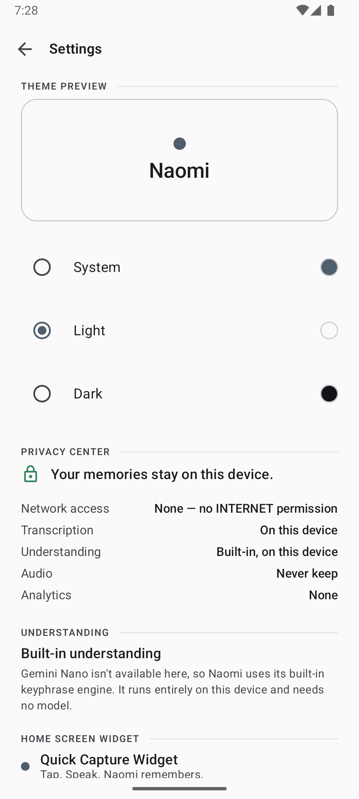 | 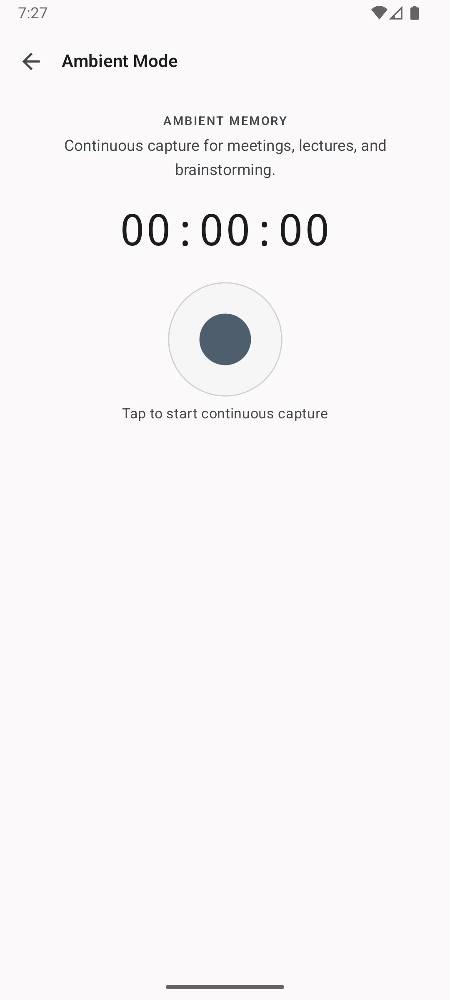 |

| Dark | Widget on the home screen |
|---|---|
| 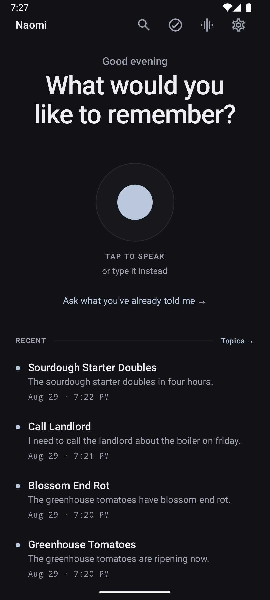 | 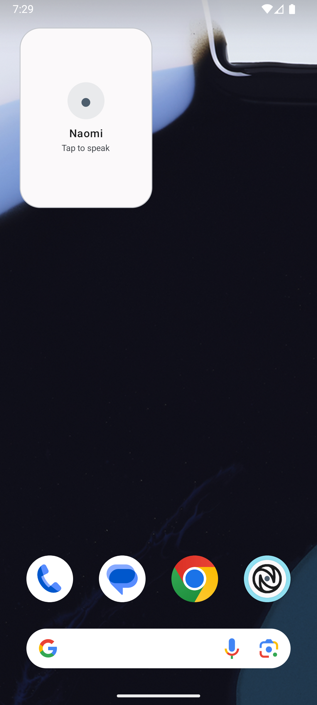 |

All of these are the running app on a `medium_phone` emulator, captured from one
session against the same memories — which is why the same greenhouse tomatoes
appear across them. None are mockups.

That is worth stating because it was not always true: earlier versions of this
file showed a `widget.png` containing no widget and a `dark-mode.png` containing
no dark mode, both the same stock launcher screenshot.

---

## Architecture

Three Gradle modules. The split is the privacy boundary, not organisation for its
own sake — see [what the networked code is allowed to know](#the-other-half-what-the-networked-code-is-allowed-to-know).

```
app/                      The application. No network capability in the
│                         offline flavour, which is the one that ships.
├── ai/intelligence/      Lexicon, KeyphraseExtractor, TopicResolver,
│                         TopicMatcher, MemoryMerger, TaskExtractor,
│                         TemporalParser, QuestionParser, SharedTextParser
├── audio/                SpeechRecognizer wrapper + ambient foreground service
├── data/
│   ├── database/         Room entities, DAOs, migrations, exported schemas
│   └── repository/       Repository implementations
├── domain/
│   ├── intelligence/     IntelligenceProvider + Nano and heuristic providers
│   ├── model/            Domain types
│   ├── repository/       Repository interfaces
│   └── usecases/         ProcessThought, AskNaomi, SyncReminders, …
├── presentation/         Compose UI, one package per screen
│   ├── components/       NaomiOrb, NaomiRow, MemoryRow, empty states
│   └── theme/            Colour, type, spacing, shape, motion
├── reminder/             AlarmManager scheduling + the one notification
├── web/                  Flavour-specific: which WebReader, if any, exists
└── widget/               RemoteViews home-screen widget (three sizes)

web-api/                  Plain Kotlin. No Android plugin, so it cannot add a
                          permission; no dependency on :app, so it has no type
                          for a memory. A URL in, a page out.

web-impl/                 The only module that can open a socket, and the only
                          manifest that asks for INTERNET. Present in the
                          `connected` flavour alone.
```

Kotlin, Jetpack Compose, Material 3, Room, Coroutines/Flow, Navigation Compose.
Around 11,900 lines across 97 files, plus 650 lines of tests. No dependency
injection framework — construction happens once in `NaomiApp`, which is enough at
this size. No HTTP client: the module allowed to make requests uses
`HttpURLConnection`, because a networking dependency is exactly the kind of thing
that arrives with a telemetry uploader attached.

**Capture is a `Flow<ProcessingStage>`.** Stages are emitted where the work
actually happens. There are no artificial delays: an earlier version showed three
"AI processing" steps driven by 900 ms of `delay()`, and that is exactly what this
design exists to prevent. If a stage cannot be reported honestly, it is not shown.

---

## Install

Naomi is distributed as a signed APK on the
[Releases](https://github.com/Asmodeus14/naomi/releases) page. It is not on Google
Play. Download the `.apk`, open it on your phone, and allow the install when
Android asks — that prompt is what sideloading looks like.

Every release ships a `SHA256SUMS.txt` so you can check you got the file the build
produced, and you can confirm the central privacy claim on the exact binary you
downloaded rather than on this README:

```bash
sha256sum naomi-0.3.0.apk           # compare against SHA256SUMS.txt
aapt2 dump permissions naomi-0.3.0.apk
```

No network permission is listed. Sideloaded apps do not update themselves, so
watch the repository for releases or point [Obtainium](https://github.com/ImranR98/Obtainium)
at it; updates install over the top and keep your memories.

---

## Build and run

Requires JDK 17 and the Android SDK (compileSdk 36).

```bash
git clone <this-repo>
cd naomi
./gradlew installOfflineDebug      # build and install on a connected device
./gradlew testOfflineDebugUnitTest # unit tests
./gradlew lintOfflineDebug         # lint — a build gate, not advisory
./gradlew assembleOfflineRelease   # minified release APK (~2 MB)
./gradlew check                    # the above plus both privacy gates
```

Task names carry the flavour. `offline` is the default and the one that is
published; substitute `connected` to build the variant with the web-reading
layer, which declares `INTERNET`. See [The two builds](#the-two-builds).

Minimum Android 8.0 (API 26). Gemini Nano needs a device with AICore; everywhere
else the built-in engine runs instead, and Settings tells you which you have.

Lint is a hard gate on purpose. It is the check that caught three widget layouts
using view classes RemoteViews does not permit — they compiled cleanly and crashed
in the launcher process at inflate time.

---

## Android release

Releases are built and signed by GitHub Actions. Full instructions are in
**[DEPLOYMENT.md](DEPLOYMENT.md)**.

```
push to main  →  lint · tests · privacy gates · both flavours    →  releases nothing
push tag v*   →  the same gates  →  signed APK + checksums       →  draft GitHub Release
```

- **Pushing to main publishes nothing.** It builds and tests. Cutting a release
  takes a tag, which is a separate and visible act.
- **The release is a draft.** Nothing is downloadable until a human opens it,
  reads it and presses Publish.
- **`versionCode` comes from the tag**, not a build counter, so re-running the
  workflow on a tag cannot produce a second binary claiming to be that release.
- **Only the `offline` flavour is published.** The `connected` build declares
  `INTERNET` and must be built from source deliberately.

Signing credentials come from a gitignored `keystore.properties` locally and from
GitHub secrets in CI. The keystore itself lives outside the repository, and no
credential is ever committed — see
[Files that must never be committed](DEPLOYMENT.md#files-that-must-never-be-committed).

With no store in the path there is no Play App Signing, which means the key that
signs these releases is the app signing key rather than a recoverable upload key.
DEPLOYMENT.md is blunt about what that costs.

```bash
./gradlew :app:verifyReleaseSigning     # is signing configured?
./gradlew :app:assembleOfflineRelease   # the APK that gets published
```

---

## Status

**Naomi is pre-1.0. The current version is `0.3.0`.** Release builds are signed
with an upload key that is not in this repository; `.gitignore` and a build check
keep it that way. See [DEPLOYMENT.md](DEPLOYMENT.md).

What works and is verified on a device: capture by voice or text, title and topic
extraction, topic reuse across sessions, subtopic nesting, **memories that
continue instead of duplicating, with a dated history**, **topic timelines**,
**Ask Naomi**, **sharing text and links in from other apps**, **reminders on the
system clock that survive a reboot**, **spoken clock times and calendar
handoff**, task extraction with resolved dates, search
that reaches inside a memory's history, the knowledge tree, Markdown export,
persisted System/Light/Dark theming, and the home-screen widget in three sizes
with **per-widget appearance** — theme, opacity and content, chosen on a
preview-driven screen and independent for every widget you place.

Known limitations, stated plainly:

- Topic and memory names come from your own words. A first memory about tomato
  seedlings creates a topic called "Tomato Seedlings", not "Gardening" — Naomi
  will not invent a category you did not say. Depth appears as you keep talking.
- **Whether a new thought continues a memory depends on what it gets titled.**
  Saying "the greenhouse tomatoes have blossom end rot" is titled *Blossom End
  Rot*, which is far enough from *Greenhouse Tomatoes* that it becomes its own
  memory under the same topic. That threshold is deliberately strict: wrongly
  merging two subjects buries one inside the other's history where you will never
  find it, while wrongly splitting leaves two entries you can see.
- **A reminder is only exact if you said an exact time.** "Remind me tomorrow at
  6 PM" gets an exact alarm. "By Friday" gets an inexact one with a window of up
  to an hour, because the 09:00 was chosen by the parser and not by you, and
  being punctual to the minute about a time nobody specified is false precision.
  If you refuse the exact-alarm permission — Android denies it by default —
  everything falls back to the inexact behaviour rather than failing. See
  `ReminderScheduler`.
- **Naomi will not invent a time.** "Meeting tomorrow" becomes a memory, not a
  9 AM appointment. Neither does it act on a time you hedged: "Rahul is coming
  tomorrow around 6" and "the meeting is usually at 6" are remembered and
  nothing else. That is deliberate, and it means some things you might have
  wanted scheduled are not.
- Inter is specified by the design but not bundled; the app uses the platform
  sans-serif. The scale, weights and tracking are what carry the design, and
  those survive the substitution. See `theme/Type.kt`.
- **Widget corner radius is not configurable**, and cannot usefully be:
  launchers on Android 12+ clip every widget to their own radius. The control
  was built and then removed after diffing screenshots of "Square" against
  "Rounded" on a real home screen and finding them identical.
- Compose UI tests are not written yet. Coverage is 122 unit tests over the
  intelligence layer and 32 instrumented tests covering migrations, the capture
  pipeline, alarm scheduling and widget rendering on a real device — but nothing
  drives the app's screens. That gap is real: several bugs this project has
  shipped and fixed — a crash when a subtopic id happened to match a note id,
  reminders silently dropped because a permission was never requested — were
  found by driving the app, not by the suite. So were two in this release: the
  widget's subtitle vanishing at low opacity, and the widget picker showing a
  white orb on a white background.

See [CHANGELOG.md](CHANGELOG.md) for what changed and [ROADMAP.md](ROADMAP.md) for
what is next.

---

## Contributing

See [CONTRIBUTING.md](CONTRIBUTING.md). Security reports go through
[SECURITY.md](SECURITY.md) — please do not open a public issue for them.

If you change the intelligence layer, add a test to
`app/src/test/java/com/naomi/app/ai/IntelligenceEngineTest.kt`. Every test in that
file exists because a real defect got through: the 2NF/3NF collision, the
"Balcony Soil Needs Better" title, the duplicate "Tomato Seedlings" topic, the
"Fence Waits Tomorrow" topic. Assert on behaviour with exact equality, and include
the negative case.

## Licence

[Apache 2.0](LICENSE).
